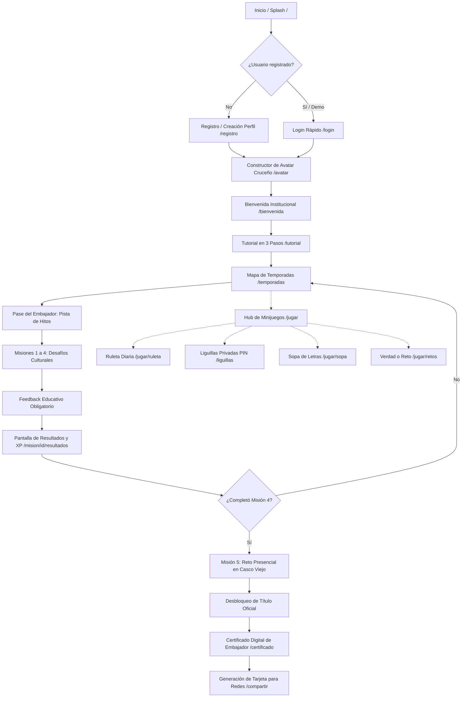

# ENTREGABLE 2: FLUJO FUNCIONAL DEL PRODUCTO Y EXPERIENCIA DE USUARIO (UX)
## Proyecto: Soy Embajador Bolivia (Fase 1: Descubre Santa Cruz)
**Cliente:** Alejandra Caballero (C.I. 3866326)  
**Prestador:** Adaptive Labs  
**Versión:** Documento Técnico v1.0  
**Fecha:** Septiembre de 2026  

---

## 1. INTRODUCCIÓN Y ARCO EMOCIONAL
El diseño de la experiencia de usuario (UX) para **Soy Embajador Bolivia** se aleja deliberadamente de un "manual digitalizado de turismo" para adoptar un modelo **Game-First** inspirado en aplicaciones líderes de microaprendizaje lúdico (Duolingo, Kahoot, Preguntados).

El recorrido del usuario responde a un **arco emocional en tres momentos**:
1. **Despertar y Curiosidad (Onboarding y Misiones 1–2):** El usuario descubre datos fascinantes que desconocía sobre Santa Cruz de la Sierra y su fundación.
2. **Competencia y Socialización (Misiones 3–4, Liguillas y Retos):** El usuario consolida su conocimiento, compite sanamente con amigos y desbloquea insignias.
3. **Orgullo y Consagración (Misión 5, Certificado y Redes):** El usuario completa su Reto Presencial, recibe el diploma oficial de "Embajador de Santa Cruz" y lo difunde con orgullo en sus redes sociales.

---

## 2. DIAGRAMA GLOBAL DEL FLUJO DE USUARIO

---

## 3. ESPECIFICACIÓN DETALLADA PANTALLA POR PANTALLA

### 1. Pantalla de Bienvenida y Splash (`/`)
* **Objetivo:** Captar el interés inmediato del visitante mediante un llamado a la acción enfocado en juego y recompensas (*"🎁 Jugá y ganá premios"*).
* **Elementos Clave:** Hero banner ilustrado de Santa Cruz, logotipo oficial de la marca, botón principal *"Jugar Ahora"* (conduce a partida rápida o registro) y selector de inicio de sesión.
* **Tono:** Cercano, hospitalario y motivacional. Cero tecnicismos ni emojis informales.

### 2. Constructor de Avatar Cruceño (`/avatar` y `/setup`)
* **Objetivo:** Generar apego identitario y personalización cultural previa al juego.
* **Mecánica UX:**
  * Vista de canvas con soporte para retrato y cuerpo entero.
  * Selector de tono de piel (6 variantes regionales) y peinados.
  * Catálogo de vestimentas y accesorios tradicionales: sombrero de saó, mochila de expedición, tipoy cruceño y camisa bordada.
  * Botón *"Guardar mi explorador"* que actualiza inmediatamente la representación gráfica en todas las pantallas.

### 3. Mapa de Temporadas y Pase del Embajador (`/temporadas`)
* **Objetivo:** Guiar la progresión del jugador con claridad visual.
* **Mecánica UX:**
  * **Pase del Embajador:** Carrusel horizontal con 5 hitos principales representados por cofres de madera chiquitana tallada. Cada hito se desbloquea al acumular puntos de temporada (20%, 40%, 60%, 80%, 100%).
  * **Misiones Narradas:** Al pulsar cada hito, se despliega una modal con la historia profunda del lugar histórico antes de iniciar las preguntas.
  * **Colección del Álbum:** Fila inferior con las 5 estampas conmemorativas de Santa Cruz (Plaza 24 de Septiembre, Catedral, Río Piraí, Toborochi, Bandera Cruceña) que se revelan al descubrirlas.

### 4. Motor de Desafíos y Misiones (`/mision/$misionId`)
* **Objetivo:** Evaluar y educar simultáneamente sin frustración.
* **Dinámica de Interacción:**
  * Preguntas cronometradas con barra superior de energía/vidas.
  * Tipología de retos: Opción múltiple, Verdadero/Falso, Casos históricos y Reconocimiento visual.
  * **Feedback Obligatorio:** Si el usuario acierta, se refuerza la relevancia cultural con felicitación cálida. Si falla, el sistema explica didácticamente el contexto histórico sin restar puntos de forma punitiva.

### 5. Reto Presencial en Santa Cruz (`/mision/m5/reto`)
* **Objetivo:** Conectar el entorno digital con el patrimonio físico real de la ciudad.
* **Dinámica:** El usuario acude a un punto histórico (Catedral, Plaza 24 de Septiembre o Manzana Uno), confirma su presencia mediante GPS simulado, sube una foto conmemorativa y escribe su compromiso ciudadano como Embajador.

### 6. Emisión de Certificado Digital (`/certificado`)
* **Objetivo:** Materializar el logro supremo del jugador y coronarlo formalmente.
* **Componentes Visuales:**
  * Fondo pergamino de alta resolución con orla dorada.
  * Emblema central de Santa Cruz y sello de "Soy Embajador Bolivia".
  * Nombre dinámico del usuario, puntaje XP acumulado, total de insignias y nivel.
  * Código de validación criptográfico (`SEB-T1-<iniciales>-<xp>`).
  * Botón de descarga/impresión directa y enlace para compartir.
  * **Bypass de Evaluación:** Botón discreto para evaluadores que permite visualizar el diploma instantáneamente sin bloquear la experiencia.

### 7. Tarjeta Social de Logros (`/compartir`)
* **Objetivo:** Fomentar la difusión viral orgánica y la adquisición de nuevos participantes.
* **Diseño:**
  * Tarjeta vertical (9:16) optimizada para Instagram Stories y estados de WhatsApp.
  * Incorporación directa del **Avatar 3D del explorador** con sus prendas equipadas.
  * Pastillas estilizadas con las insignias desbloqueadas y marca de agua `bolivia.embajador.app`.
  * Integración con la Web Share API en dispositivos móviles y copiado automático al portapapeles en escritorio.

### 8. Liguillas Privadas y Minijuegos Sociales (`/liguillas`, `/jugar/sopa`, `/jugar/retos`)
* **Objetivo:** Dinamizar la participación en colegios, familias y grupos de amigos.
* **Flujo Liguillas:** Creación de sala privada ➔ Asignación de código PIN de 6 dígitos ➔ Unirse a la sala ➔ Preguntas sincronizadas ➔ Podio final cerrado con trofeo conmemorativo.
* **Flujo Sopa de Letras:** Cuadrícula táctil interactiva donde se descubren palabras cruceñas típicas con recompensas de monedas.
* **Flujo Verdad o Reto:** Ruleta de preguntas personales y retos culturales para jugar de 2 a 6 personas en reuniones.

---

## 4. CONCLUSIÓN DE USABILIDAD
El flujo funcional respeta los principios de diseño de accesibilidad, legibilidad con luz natural en teléfonos inteligentes, navegación intuitiva con botones de retroceso siempre visibles (`BotonVolver`) y una arquitectura de componentes reutilizables libre de dependencias rígidas.
