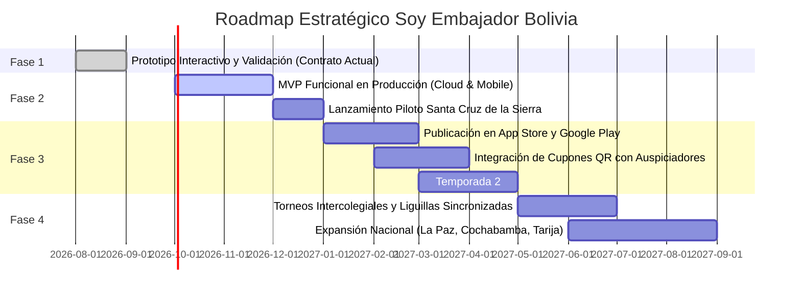

# ENTREGABLE 4: ROADMAP INICIAL DEL PROYECTO (EVOLUCIÓN EN FASES)
## Proyecto: Soy Embajador Bolivia (Fase 1: Descubre Santa Cruz)
**Cliente:** Alejandra Caballero (C.I. 3866326)  
**Prestador:** Adaptive Labs  
**Versión:** Plan Estratégico de Evolución v1.0  
**Fecha:** Septiembre de 2026  

---

## 1. VISIÓN ESTRATÉGICA
El objetivo a mediano y largo plazo de **Soy Embajador Bolivia** es consolidarse como la plataforma lúdico-educativa y turística de referencia nacional, conectando el orgullo regional y el patrimonio cultural con incentivos del comercio local y alianzas institucionales (gobernaciones, alcaldías, cámaras hoteleras y gastronómicas).

Para alcanzar esta visión sin incurrir en riesgos desmedidos, se ha estructurado un **Roadmap de 4 Fases Progresivas**:

---

## 2. DETALLE DE FASES DE EVOLUCIÓN

### FASE 1: Prototipado Interactivo y Validación (COMPLETADA)
* **Objetivo:** Materializar la visión del producto en un prototipo de alta fidelidad, definir la UX/UI, validar el arco narrativo y auditar el sistema de juego con stakeholders.
* **Hito de Cierre:** Entrega de los 5 documentos contractuales y prototipo interactivo con 28 pantallas navegables en `main`.

---

### FASE 2: Construcción del MVP Funcional y Lanzamiento Piloto (Meses 1 a 3)
* **Objetivo:** Pasar del prototipo en memoria a una aplicación web progresiva (PWA) conectada a la nube con usuarios reales en Santa Cruz de la Sierra.
* **Entregables Principales:**
  1. Base de datos en PostgreSQL con modelo relacional para usuarios, partidas, inventario de avatares y respuestas.
  2. Sistema de autenticación con Google y enlace directo a WhatsApp para inicio de sesión en Bolivia.
  3. Despliegue de la API y servidor en infraestructura de alta disponibilidad (Cloudflare Workers / Vercel + Supabase).
  4. Geolocalización real para verificar la presencia física en el Reto Presencial (Catedral / Plaza 24 de Septiembre).
  5. Backoffice administrativo para que el equipo de Alejandra Caballero pueda subir nuevas preguntas y aprobar fotos del reto presencial.
* **Meta de Adopción:** 1,000 usuarios activos en el mes piloto en Santa Cruz.

---

### FASE 3: Distribución Nativa y Alianzas Comerciales (Meses 4 a 6)
* **Objetivo:** Expansión a tiendas de aplicaciones móviles y monetización mediante patrocinadores del sector turístico y gastronómico.
* **Entregables Principales:**
  1. Empaquetado nativo mediante **Capacitor** para publicación oficial en **Google Play Store** y **Apple App Store**.
  2. Módulo de **Auspiciadores y Cupones QR**: Los usuarios canjean sus monedas ganadas por descuentos reales en cafeterías, restaurantes típicos (Majadito, Cuñapés) y museos locales, validados mediante escaneo en caja.
  3. Lanzamiento de la **Temporada 2: "Ruta de la Chiquitania"** (San Javier, Concepción, San Ignacio de Velasco).
* **Meta de Adopción:** 10,000 usuarios y 15 marcas comerciales afiliadas.

---

### FASE 4: Escalabilidad Social y Expansión Nacional (Meses 7 a 9)
* **Objetivo:** Masificación a nivel escolar/universitario y cobertura de los demás departamentos de Bolivia.
* **Entregables Principales:**
  1. **Liguillas Escolares en Vivo:** Sistema de salas multijugador sincronizadas mediante WebSockets para competencias en aulas y eventos públicos.
  2. Lanzamiento de las temporadas departamentales:
     * *Temporada La Paz:* Illimani, Tiwanaku, teleférico y gastronomía andina.
     * *Temporada Cochabamba:* Capital gastronómica, Cristo de la Concordia y valles.
     * *Temporada Tarija:* Ruta del vino, San Roque y tradición chapaca.
  3. Título Supremo de **"Gran Embajador de Bolivia"** para usuarios que completen 3 o más departamentos.
* **Meta de Adopción:** 50,000 usuarios en toda Bolivia y respaldo institucional del Viceministerio de Turismo.
